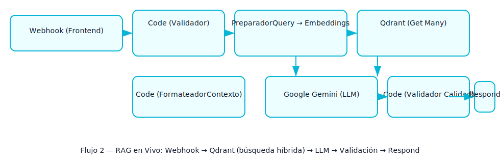

# Planificador de Viajes RAG con n8n y Qdrant

## Descripción del Proyecto

Este proyecto es la implementación de un sistema de Generación Aumentada por Recuperación (RAG) de extremo a extremo, diseñado para cumplir con los requisitos del Caso Práctico de la Unidad 1 de IEP (IEP-IAA-GIA_u1.pdf).

El sistema funciona como una aplicación web que permite a los usuarios planificar un viaje personalizado al estado de Chihuahua, México. El usuario introduce sus preferencias en un formulario (destino, duración, presupuesto, intereses) y el backend, orquestado con n8n, utiliza un flujo RAG para consultar una base de conocimiento vectorial (Qdrant) y generar un itinerario coherente y relevante usando un LLM (Google Gemini).

---

## Conceptos Clave Demostrados (Mapeo de Requisitos)

- Requisito 1 y 8 (Interfaz de Usuario): Se desarrolló un frontend (`index.html`) utilizando Tailwind CSS para un diseño moderno y responsivo. Este frontend incluye un formulario completo, un popup de carga dinámico y JavaScript (fetch) para la comunicación asíncrona con el backend de n8n.

- Requisito 2 y 3 (LLM y Prompting): Se utilizó Google Gemini como el LLM base. Se implementó una técnica de prompting dinámico: el prompt final se construye en tiempo de ejecución, inyectando tanto la solicitud original del usuario (`solicitud_original`) como el contexto recuperado del RAG (`contexto_rag`).

- Requisito 4 (RAG - Generación Aumentada por Recuperación): Se implementó un sistema RAG completo dividido en dos flujos:

  - Ingesta (Flujo 1): Se construyó una base de conocimiento personalizada sobre el turismo en Chihuahua. Los datos JSON crudos se procesan, se dividen en chunks semánticos (Guía, Opinión, Datos) y se cargan en Qdrant Cloud.

  - Consulta (Flujo 2): Se implementó una Búsqueda Híbrida. La consulta del usuario se usa para la búsqueda vectorial (semántica), mientras que sus intereses y destino se usan para el filtrado de metadatos (la parte más difícil y crucial), asegurando que solo se recuperen los chunks más relevantes.

- Requisito 7 (Control de Calidad): Se implementaron dos capas de validación en el flujo de n8n:
  - Validación de Entrada: Un nodo Code + IF justo después del Webhook valida que la solicitud del usuario (formulario) esté correctamente estructurada (fail-fast).
  - Validación de Salida: Un nodo Code + IF después del LLM (Google Gemini) verifica la calidad de la respuesta generada, asegurando que sea relevante (mencione el destino) y no sea un mensaje de error del LLM.

---

## Arquitectura de la Solución

El sistema se compone de tres partes principales:

- Frontend (`index.html`): Una página estática (alojada en GitHub Pages) que contiene el formulario de 5 campos y el lienzo de respuesta.

- Backend (n8n): Dos flujos de trabajo de n8n que manejan toda la lógica.
  - Flujo 1 (Ingesta): Un flujo manual que transforma y carga el JSON de conocimiento a Qdrant.
  - Flujo 2 (RAG en Vivo): Un flujo activado por Webhook que actúa como la API para el frontend.

- Base de Conocimiento (Qdrant Cloud): Una colección en Qdrant Cloud que almacena los vectores (Embeddings de Gemini) y los metadatos indexados (Payload Indexes).

---

## Stack Tecnológico

- Frontend: HTML, Tailwind CSS, JavaScript (ES6+ fetch), Showdown.js (para renderizar Markdown).
- Backend / Orquestación: n8n (self-hosted o cloud).
- LLM & Embeddings: Google Gemini (Modelo: gemini-1.5-pro y Modelo Embedding: embedding-001/004).
- Base de Datos Vectorial: Qdrant Cloud.

---

## Implementación: Los Flujos de n8n

El proyecto consta de dos flujos de trabajo principales en n8n:

### Flujo 1: Ingesta (ETL de Vectores)

Este flujo se ejecuta manualmente para poblar la base de datos vectorial.

Start -> Code (Datos Crudos) -> Code (Procesador) -> Qdrant Vector Store

- Code (Datos Crudos): Un nodo de código donde se pega el JSON de investigación (el reporte de análisis y el de gastronomía).
- Code (Procesador): Detecta estructuras, aplica chunking (Guía, Opinión, Datos) y formatea la salida a `{ pageContent: "...", metadata: {...} }`.
- Qdrant Vector Store: Insert Documents usando Embeddings Google Gemini.


### Flujo 2: RAG en Vivo (La API)

Webhook -> Code (Validador) -> IF (Válido?) -> (rama true) -> Code (PreparadorQuery) -> Qdrant -> Code (FormateadorContexto) -> Gemini -> Code (Validador Calidad) -> IF (Calidad OK?) -> Respond (Éxito)

- Code (Validador): Valida los 5 campos del formulario.
- Code (PreparadorQuery): Traduce campos en `query_vector` y `query_filtros`.
- Qdrant Vector Store: Búsqueda híbrida con filtrado por metadatos.
- Code (FormateadorContexto): Recibe los chunks y formatea `contexto_rag`.
- Google Gemini: Genera respuesta usando prompt dinámico.
- Code (Validador Calidad): Verifica relevancia y formato.



---

## Reflexiones y Deuda Técnica

- El objetivo principal fue demostrar la comprensión de RAG; se ha logrado.
- Deuda Técnica: El Flujo 1 actualmente requiere pegar JSON grande en un nodo Code — no es escalable. Una mejora sería aceptar uploads o Webhooks para ingesta repetible.

---

## Cómo publicar en GitHub y activar Pages (resumen)

1. Crea un repositorio nuevo en GitHub (por ejemplo `planificador-viajes-rag`).
2. Añade el remoto y sube:

```bash
git remote add origin https://github.com/<tu-usuario>/<tu-repo>.git
git push -u origin main
git push -u origin gh-pages
```

3. En GitHub -> Settings -> Pages, configura la rama `gh-pages` (o `main` / `docs/`) como fuente de GitHub Pages.

---

## Notas finales

- Este repositorio contiene el frontend estático y la documentación. Los flujos de n8n y la colección de Qdrant deben exportarse/compartirse por separado (JSON de flujos y backup de colección) si se requiere reproducibilidad total.

---

Si quieres, puedo: crear el repo localmente, inicializar Git y hacer el commit inicial (lo puedo ejecutar ahora), y darte los pasos exactos para crear el repo remoto y publicar en GitHub Pages.
